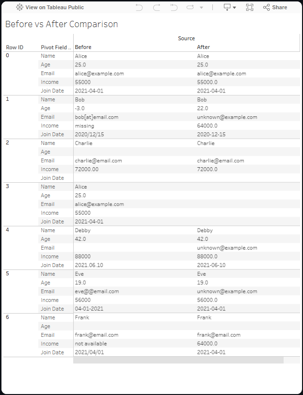

# ai-data-cleaning-assistant

An AI-powered web app that automatically cleans messy CSV datasets and provides a before vs after comparison through **tableau** and **Streamlit** visualizations.

**Live Demo: https://ai-data-cleaning-assistant-sjvyerr6ubhbbgynfqjw3z.streamlit.app/**

_Note on Loading Time_
```text
Because the web app is hosted on a free Streamlit service, it automatically goes to sleep after periods of
inactivity. If you visit the app after it has been idle, the first request can take up to 30 seconds to
respond while the server wakes up. Subsequent requests will be much faster.
```

---

**Features**
- Upload any CSV file and receive:
  - AI-generated cleaning recommendations using the OpenAI API
  - Automatic safe cleaning for common issues:
    - Missing values
    - Negative numeric values
    - Invalid email formats
    - Non-standard date formats
    - Non-numeric values in numeric columns
    - Duplicate rows
  - Downloadable cleaned CSV
- Side-by-side "Before" vs "After" dataset preview
- Built-in sample dataset for demonstration
- Integrated Tableau dashboard to show transformation results visually
- Streamlit visualizations (e.g., column comparisons) for quick insights

---

**Dataset**

Includes a sample messy dataset (data/raw/sample_messy.csv) containing:
- Missing values in multiple columns
- Mixed date formats
- Invalid emails and non-numeric numeric fields
- Duplicate rows

An alternate dataset (data/raw/sample_messy_alt.csv) is also provided for testing, with different values from the Tableau example.

---

**Project Structure**
```text
├── app.py                      # Streamlit frontend
├── run_assistant.py            # Pipeline to run analysis + cleaning
├── analyze_csv.py              # Column profiling
├── gpt_advisor.py              # GPT cleaning suggestion generator
├── auto_cleaner.py             # Automatic cleaning rules
├── data/
│   ├── raw/                    # Sample + uploaded datasets
│   └── cleaned/                # Cleaned output + Tableau comparison
├── logs/                       # Cleaning suggestions + logs
├── scripts/
│   ├── generate_cleaning_report.py  # Creates cleaning summary report
│   ├── main.py                      # Script entry point (if running from CLI)
│   └── upload_csv.py                 # Handles CSV uploads from scripts
├── requirements.txt
└── README.md
```

---

**How to Run Locally**

1. Clone the repository:
```text
git clone https://github.com/<your-username>/ai-data-cleaning-assistant.git
cd ai-data-cleaning-assistant
```
2. Create a virtual environment and activate it:
```text
python -m venv venv
# Windows
venv\Scripts\activate
# macOS/Linux
source venv/bin/activate
```
3. Install dependencies:
```text
pip install -r requirements.txt
```
4. Add your OpenAI API key:
- Create a .env file in the project root:
```text
OPENAI_API_KEY=sk-your-key-here
```
5. Run the Streamlit app:
```text
streamlit run app.py
```
6. Open in your browser at:
```text
http://localhost:8501
```

---

**Deployment**

- Frontend: Streamlit Cloud

- Secrets: Stored securely in .streamlit/secrets.toml

- Tableau Dashboard: Embedded for visual demonstration of the cleaning process

---
**Example Workflow**
1. Upload a messy CSV file
2. AI analyzes and suggests cleaning actions
3. Automatic safe cleaning is applied
4. View:
    - Before vs After dataset in table form
    - Side-by-side comparison CSV for Tableau
    - Built-in charts (e.g., Age comparison)
5. Download your cleaned CSV

**Example Tableau Dashboard**



**License**

This project is licensed under the MIT License.

**Acknowledgments**
- OpenAI Python SDK
- Pandas
- Streamlit
- Tableau Public


